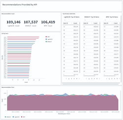

# Cornac

**Cornac** is a comparative framework for multimodal recommender systems. It focuses on making it **convenient** to work with models leveraging **auxiliary data** (e.g., item descriptive text and image, social network, etc). **Cornac** enables **fast** experiments and **straightforward** implementations of new models. It is **highly compatible** with existing machine learning libraries (e.g., TensorFlow, PyTorch).

*Cornac is one of the frameworks recommended by [ACM RecSys 2023](https://github.com/ACMRecSys/recsys-evaluation-frameworks) for the evaluation and reproducibility of recommendation algorithms. In addition, the implementation of BPR model in Cornac has been recommended as trustworthy baseline for RecSys comparison by [independent research](https://dl.acm.org/doi/abs/10.1145/3640457.3688073).*

### Quick Links

[Website](https://cornac.preferred.ai/) |
[Documentation](https://cornac.readthedocs.io/en/stable/index.html) |
[Tutorials](tutorials#tutorials) |
[Examples](https://github.com/PreferredAI/cornac/tree/master/examples#cornac-examples-directory) |
[Models](#models) |
[Datasets](./cornac/datasets/README.md#datasets) |
[Paper](http://www.jmlr.org/papers/volume21/19-805/19-805.pdf) |
[Preferred.AI](https://preferred.ai/)

[](https://dev.azure.com/conda-forge/feedstock-builds/_build/latest?definitionId=6683&branchName=main)
[](https://github.com/PreferredAI/cornac/actions/workflows/python-package.yml)
[](https://circleci.com/gh/PreferredAI/cornac)
[](https://cornac.readthedocs.io/en/stable)
[](https://codecov.io/gh/PreferredAI/cornac)
<br />
[](https://github.com/PreferredAI/cornac/releases)
[](https://pypi.org/project/cornac/)
[](https://anaconda.org/conda-forge/cornac)
[](https://github.com/conda-forge/cornac-feedstock)


<br />
[](https://cornac.preferred.ai/)
[](https://anaconda.org/conda-forge/cornac)


## Installation

Currently, we are supporting Python 3. There are several ways to install Cornac:

- **From PyPI (recommended):**
  ```bash
  pip3 install cornac
  ```

- **From Anaconda:**
  ```bash
  conda install cornac -c conda-forge
  ```

- **From the GitHub source (for latest updates):**
  ```bash
  pip3 install git+https://github.com/PreferredAI/cornac.git
  ```

**Note:**

Additional dependencies required by models are listed [here](README.md#Models).

Some algorithm implementations use `OpenMP` to support multi-threading. For Mac OS users, in order to run those algorithms efficiently, you might need to install `gcc` from Homebrew to have an OpenMP compiler:
```bash
brew install gcc | brew link gcc
```

## Getting started: your first Cornac experiment


<p align="center"><i>Flow of an Experiment in Cornac</i></p>

```python
import cornac
from cornac.eval_methods import RatioSplit
from cornac.models import MF, PMF, BPR
from cornac.metrics import MAE, RMSE, Precision, Recall, NDCG, AUC, MAP

# load the built-in MovieLens 100K and split the data based on ratio
ml_100k = cornac.datasets.movielens.load_feedback()
rs = RatioSplit(data=ml_100k, test_size=0.2, rating_threshold=4.0, seed=123)

# initialize models, here we are comparing: Biased MF, PMF, and BPR
mf = MF(k=10, max_iter=25, learning_rate=0.01, lambda_reg=0.02, use_bias=True, seed=123)
pmf = PMF(k=10, max_iter=100, learning_rate=0.001, lambda_reg=0.001, seed=123)
bpr = BPR(k=10, max_iter=200, learning_rate=0.001, lambda_reg=0.01, seed=123)
models = [mf, pmf, bpr]

# define metrics to evaluate the models
metrics = [MAE(), RMSE(), Precision(k=10), Recall(k=10), NDCG(k=10), AUC(), MAP()]

# put it together in an experiment, voilà!
cornac.Experiment(eval_method=rs, models=models, metrics=metrics, user_based=True).run()
```

**Output:**

|                          |    MAE |   RMSE |    AUC |     MAP | NDCG@10 | Precision@10 | Recall@10 |  Train (s) | Test (s) |
| ------------------------ | -----: | -----: | -----: | ------: | ------: | -----------: | --------: | ---------: | -------: |
| [MF](cornac/models/mf)   | 0.7430 | 0.8998 | 0.7445 |  0.0548 |  0.0761 |       0.0675 |    0.0463 |       0.13 |     1.57 |
| [PMF](cornac/models/pmf) | 0.7534 | 0.9138 | 0.7744 |  0.0671 |  0.0969 |       0.0813 |    0.0639 |       2.18 |     1.64 |
| [BPR](cornac/models/bpr) |    N/A |    N/A | 0.8695 |  0.1042 |  0.1500 |       0.1110 |    0.1195 |       3.74 |     1.49 |


## Model serving

Here, we provide a simple way to serve a Cornac model by launching a standalone web service with [Flask](https://github.com/pallets/flask). It is very handy for testing or creating a demo application. First, we install the dependency:
```bash
$ pip3 install Flask
```
Supposed that we want to serve the trained BPR model from previous example, we need to save it:
```python
bpr.save("save_dir", save_trainset=True)
```
After that, the model can be deployed easily by running Cornac serving app as follows:
```bash
$ FLASK_APP='cornac.serving.app' \
  MODEL_PATH='save_dir/BPR' \
  MODEL_CLASS='cornac.models.BPR' \
  flask run --host localhost --port 8080

# Running on http://localhost:8080
```
Here we go, our model service is now ready. Let's get `top-5` item recommendations for the user `"63"`:
```bash
$ curl -X GET "http://localhost:8080/recommend?uid=63&k=5&remove_seen=false"

# Response: {"recommendations": ["50", "181", "100", "258", "286"], "query": {"uid": "63", "k": 5, "remove_seen": false}}
```
If we want to remove seen items during training, we need to provide `TRAIN_SET` which has been saved with the model earlier, when starting the serving app. We can also leverage [WSGI](https://flask.palletsprojects.com/en/3.0.x/deploying/) server for model deployment in production. Please refer to [this](https://cornac.readthedocs.io/en/stable/user/iamadeveloper.html#running-an-api-service) guide for more details.

## Model A/B testing

[Cornac-AB](https://github.com/preferredAI/cornac-ab) is an extension of Cornac using the Cornac Serving API. Easily create and manage A/B testing experiments to further understand your model performance with online users.

| User Interaction Solution | Recommendations Dashboard | Feedback Dashboard |
|:------------------------:|:------------------------:|:------------------:|
|  |  |  |

## Efficient retrieval with ANN search

One important aspect of deploying recommender model is efficient retrieval via Approximate Nearest Neighbor (ANN) search in vector space. Cornac integrates several vector similarity search frameworks for the ease of deployment. [This example](tutorials/ann_hnswlib.ipynb) demonstrates how ANN search will work seamlessly with any recommender models supporting it (e.g., matrix factorization).

| Supported Framework | Cornac Wrapper | Example |
| :-----------------: | :------------: | :-----: |
| [spotify/annoy](https://github.com/spotify/annoy) | [AnnoyANN](cornac/models/ann/recom_ann_annoy.py) | [quick-start](examples/ann_example.py), [deep-dive](examples/ann_all.ipynb)
| [meta/faiss](https://github.com/facebookresearch/faiss) | [FaissANN](cornac/models/ann/recom_ann_faiss.py) | [quick-start](examples/ann_example.py), [deep-dive](examples/ann_all.ipynb)
| [nmslib/hnswlib](https://github.com/nmslib/hnswlib) | [HNSWLibANN](cornac/models/ann/recom_ann_hnswlib.py) | [quick-start](examples/ann_example.py), [hnsw-lib](tutorials/ann_hnswlib.ipynb), [deep-dive](examples/ann_all.ipynb)
| [google/scann](https://github.com/google-research/google-research/tree/master/scann) | [ScaNNANN](cornac/models/ann/recom_ann_scann.py) | [quick-start](examples/ann_example.py), [deep-dive](examples/ann_all.ipynb)


## Models

The table below lists the recommendation models/algorithms featured in Cornac. Examples are provided as quick-start showcasing an easy to run script, or as deep-dive explaining the math and intuition behind each model. Why don't you join us to lengthen the list?

| Year | Model and Paper | Type | Environment | Example |
| :--: | --------------- | :--: | :---------: | :-----: |
| 2024 | [Comparative Aspects and Opinions Ranking for Recommendation Explanations (Companion)](cornac/models/companion), [docs](https://cornac.readthedocs.io/en/stable/api_ref/models.html#module-cornac.models.companion.recom_companion), [paper](https://lthoang.com/assets/publications/mlj24.pdf) | Hybrid / Sentiment / Explainable | CPU | [quick-start](examples/companion_example.py)
|      | [Hypergraphs with Attention on Reviews (HypAR)](cornac/models/hypar), [docs](https://cornac.readthedocs.io/en/stable/api_ref/models.html#module-cornac.models.hypar.recom_hypar), [paper](https://doi.org/10.1007/978-3-031-56027-9_14)| Hybrid / Sentiment / Explainable | [requirements](cornac/models/hypar/requirements_cu116.txt), CPU / GPU | [quick-start](https://github.com/PreferredAI/HypAR)
| 2023 | [Scalable Approximate NonSymmetric Autoencoder (SANSA)](cornac/models/sansa), [docs](https://cornac.readthedocs.io/en/stable/api_ref/models.html#module-cornac.models.sansa.recom_sansa), [paper](https://dl.acm.org/doi/10.1145/3604915.3608827) | Collaborative Filtering | [requirements](cornac/models/sansa/requirements.txt), CPU | [quick-start](examples/sansa_movielens.py), [150k-items](examples/sansa_tradesy.py)
| 2022 | [Disentangled Multimodal Representation Learning for Recommendation (DMRL)](cornac/models/dmrl), [docs](https://cornac.readthedocs.io/en/stable/api_ref/models.html#module-cornac.models.dmrl.recom_dmrl), [paper](https://arxiv.org/pdf/2203.05406.pdf) | Content-Based / Text & Image | [requirements](cornac/models/dmrl/requirements.txt), CPU / GPU | [quick-start](examples/dmrl_example.py)
| 2021 | [Bilateral Variational Autoencoder for Collaborative Filtering (BiVAECF)](cornac/models/bivaecf), [docs](https://cornac.readthedocs.io/en/stable/api_ref/models.html#module-cornac.models.bivaecf.recom_bivaecf), [paper](https://dl.acm.org/doi/pdf/10.1145/3437963.3441759) | Collaborative Filtering / Content-Based | [requirements](cornac/models/bivaecf/requirements.txt), CPU / GPU | [quick-start](https://github.com/PreferredAI/bi-vae), [deep-dive](https://github.com/recommenders-team/recommenders/blob/main/examples/02_model_collaborative_filtering/cornac_bivae_deep_dive.ipynb)
|      | [Causal Inference for Visual Debiasing in Visually-Aware Recommendation (CausalRec)](cornac/models/causalrec), [docs](https://cornac.readthedocs.io/en/stable/api_ref/models.html#module-cornac.models.causalrec.recom_causalrec), [paper](https://arxiv.org/abs/2107.02390) | Content-Based / Image | [requirements](cornac/models/causalrec/requirements.txt), CPU / GPU | [quick-start](examples/causalrec_clothing.py)
|      | [Explainable Recommendation with Comparative Constraints on Product Aspects (ComparER)](cornac/models/comparer), [docs](https://cornac.readthedocs.io/en/stable/api_ref/models.html#module-cornac.models.comparer.recom_comparer_sub), [paper](https://dl.acm.org/doi/pdf/10.1145/3437963.3441754) | Explainable | CPU | [quick-start](https://github.com/PreferredAI/ComparER)
| 2020 | [Adversarial Multimedia Recommendation (AMR)](cornac/models/amr), [docs](https://cornac.readthedocs.io/en/stable/api_ref/models.html#module-cornac.models.amr.recom_amr), [paper](https://ieeexplore.ieee.org/document/8618394) | Content-Based / Image | [requirements](cornac/models/amr/requirements.txt), CPU / GPU | [quick-start](examples/amr_clothing.py)
|      | [Hybrid Deep Representation Learning of Ratings and Reviews (HRDR)](cornac/models/hrdr), [docs](https://cornac.readthedocs.io/en/stable/api_ref/models.html#module-cornac.models.hrdr.recom_hrdr), [paper](https://www.sciencedirect.com/science/article/abs/pii/S0925231219313207) | Content-Based / Text | [requirements](cornac/models/hrdr/requirements.txt), CPU / GPU | [quick-start](examples/hrdr_example.py)
|      | [LightGCN: Simplifying and Powering Graph Convolution Network](cornac/models/lightgcn), [docs](https://cornac.readthedocs.io/en/stable/api_ref/models.html#module-cornac.models.lightgcn.recom_lightgcn), [paper](https://arxiv.org/pdf/2002.02126.pdf) | Collaborative Filtering | [requirements](cornac/models/lightgcn/requirements.txt), CPU / GPU | [quick-start](examples/lightgcn_example.py)
|      | [Predicting Temporal Sets with Deep Neural Networks (DNNTSP)](cornac/models/dnntsp), [docs](https://cornac.readthedocs.io/en/stable/api_ref/models.html#module-cornac.models.dnntsp.recom_dnntsp), [paper](https://arxiv.org/pdf/2006.11483.pdf) | Next-Basket | [requirements](cornac/models/dnntsp/requirements.txt), CPU / GPU | [quick-start](examples/dnntsp_tafeng.py)
|      | [Recency Aware Collaborative Filtering (UPCF)](cornac/models/upcf), [docs](https://cornac.readthedocs.io/en/stable/api_ref/models.html#module-cornac.models.upcf.recom_upcf), [paper](https://dl.acm.org/doi/abs/10.1145/3340631.3394850) | Next-Basket | [requirements](cornac/models/upcf/requirements.txt), CPU | [quick-start](examples/upcf_tafeng.py)
|      | [Temporal-Item-Frequency-based User-KNN (TIFUKNN)](cornac/models/tifuknn), [docs](https://cornac.readthedocs.io/en/stable/api_ref/models.html#module-cornac.models.tifuknn.recom_tifuknn), [paper](https://arxiv.org/pdf/2006.00556.pdf) | Next-Basket | CPU | [quick-start](examples/tifuknn_tafeng.py)
|      | [Variational Autoencoder for Top-N Recommendations (RecVAE)](cornac/models/recvae), [docs](https://cornac.readthedocs.io/en/stable/api_ref/models.html#module-cornac.models.recvae.recom_recvae), [paper](https://doi.org/10.1145/3336191.3371831) | Collaborative Filtering | [requirements](cornac/models/recvae/requirements.txt), CPU / GPU | [quick-start](examples/recvae_example.py)
| 2019 | [Correlation-Sensitive Next-Basket Recommendation (Beacon)](cornac/models/beacon), [docs](https://cornac.readthedocs.io/en/stable/api_ref/models.html#correlation-sensitive-next-basket-recommendation-beacon), [paper](https://www.ijcai.org/proceedings/2019/0389.pdf) | Next-Basket | [requirements](cornac/models/beacon/requirements.txt), CPU / GPU | [quick-start](examples/beacon_tafeng.py)
|      | [Embarrassingly Shallow Autoencoders for Sparse Data (EASEᴿ)](cornac/models/ease), [docs](https://cornac.readthedocs.io/en/stable/api_ref/models.html#module-cornac.models.ease.recom_ease), [paper](https://arxiv.org/pdf/1905.03375.pdf) | Collaborative Filtering | CPU | [quick-start](examples/ease_movielens.py)
|      | [Neural Graph Collaborative Filtering (NGCF)](cornac/models/ngcf), [docs](https://cornac.readthedocs.io/en/stable/api_ref/models.html#module-cornac.models.ngcf.recom_ngcf), [paper](https://arxiv.org/pdf/1905.08108.pdf) | Collaborative Filtering | [requirements](cornac/models/ngcf/requirements.txt), CPU / GPU | [quick-start](examples/ngcf_example.py)
| 2018 | [Collaborative Context Poisson Factorization (C2PF)](cornac/models/c2pf), [docs](https://cornac.readthedocs.io/en/stable/api_ref/models.html#module-cornac.models.c2pf.recom_c2pf), [paper](https://www.ijcai.org/proceedings/2018/0370.pdf) | Content-Based / Graph | CPU | [quick-start](examples/c2pf_example.py)
|      | [Graph Convolutional Matrix Completion (GCMC)](cornac/models/gcmc), [docs](https://cornac.readthedocs.io/en/stable/api_ref/models.html#module-cornac.models.gcmc.recom_gcmc), [paper](https://www.kdd.org/kdd2018/files/deep-learning-day/DLDay18_paper_32.pdf) | Collaborative Filtering | [requirements](cornac/models/gcmc/requirements.txt), CPU / GPU | [quick-start](examples/gcmc_example.py)
|      | [Multi-Task Explainable Recommendation (MTER)](cornac/models/mter), [docs](https://cornac.readthedocs.io/en/stable/api_ref/models.html#module-cornac.models.mter.recom_mter), [paper](https://arxiv.org/pdf/1806.03568.pdf) | Explainable | CPU | [quick-start](examples/mter_example.py), [deep-dive](https://github.com/PreferredAI/tutorials/blob/master/recommender-systems/07_explanations.ipynb)
|      | [Neural Attention Rating Regression with Review-level Explanations (NARRE)](cornac/models/narre), [docs](https://cornac.readthedocs.io/en/stable/api_ref/models.html#module-cornac.models.narre.recom_narre), [paper](http://www.thuir.cn/group/~YQLiu/publications/WWW2018_CC.pdf) | Explainable / Content-Based | [requirements](cornac/models/narre/requirements.txt), CPU / GPU | [quick-start](examples/narre_example.py)
|      | [Probabilistic Collaborative Representation Learning (PCRL)](cornac/models/pcrl), [docs](https://cornac.readthedocs.io/en/stable/api_ref/models.html#module-cornac.models.pcrl.recom_pcrl), [paper](http://www.hadylauw.com/publications/uai18.pdf) | Content-Based / Graph | [requirements](cornac/models/pcrl/requirements.txt), CPU / GPU | [quick-start](examples/pcrl_example.py)
|      | [Variational Autoencoder for Collaborative Filtering (VAECF)](cornac/models/vaecf), [docs](https://cornac.readthedocs.io/en/stable/api_ref/models.html#module-cornac.models.vaecf.recom_vaecf), [paper](https://arxiv.org/pdf/1802.05814.pdf) | Collaborative Filtering | [requirements](cornac/models/vaecf/requirements.txt), CPU / GPU | [quick-start](examples/vaecf_citeulike.py), [param-search](tutorials/param_search_vaecf.ipynb), [deep-dive](https://github.com/PreferredAI/tutorials/blob/master/recommender-systems/09_deep_learning.ipynb)
| 2017 | [Collaborative Variational Autoencoder (CVAE)](cornac/models/cvae), [docs](https://cornac.readthedocs.io/en/stable/api_ref/models.html#module-cornac.models.cvae.recom_cvae), [paper](http://eelxpeng.github.io/assets/paper/Collaborative_Variational_Autoencoder.pdf) | Content-Based / Text | [requirements](cornac/models/cvae/requirements.txt), CPU / GPU | [quick-start](examples/cvae_example.py)
|      | [Conditional Variational Autoencoder for Collaborative Filtering (CVAECF)](cornac/models/cvaecf), [docs](https://cornac.readthedocs.io/en/stable/api_ref/models.html#module-cornac.models.cvaecf.recom_cvaecf), [paper](https://dl.acm.org/doi/10.1145/3132847.3132972) | Content-Based / Text | [requirements](cornac/models/cvaecf/requirements.txt), CPU / GPU | [quick-start](examples/cvaecf_filmtrust.py)
|      | [Generalized Matrix Factorization (GMF)](cornac/models/ncf), [docs](https://cornac.readthedocs.io/en/stable/api_ref/models.html#module-cornac.models.ncf.recom_gmf), [paper](https://arxiv.org/pdf/1708.05031.pdf) | Collaborative Filtering | [requirements](cornac/models/ncf/requirements.txt), CPU / GPU | [quick-start](examples/ncf_example.py), [deep-dive](https://github.com/PreferredAI/tutorials/blob/master/recommender-systems/09_deep_learning.ipynb)
|      | [Indexable Bayesian Personalized Ranking (IBPR)](cornac/models/ibpr), [docs](https://cornac.readthedocs.io/en/stable/api_ref/models.html#module-cornac.models.ibpr.recom_ibpr), [paper](http://www.hadylauw.com/publications/cikm17a.pdf) | Collaborative Filtering | [requirements](cornac/models/ibpr/requirements.txt), CPU / GPU | [quick-start](examples/ibpr_example.py), [deep-dive](https://github.com/PreferredAI/tutorials/blob/master/recommender-systems/08_retrieval.ipynb)
|      | [Matrix Co-Factorization (MCF)](cornac/models/mcf), [docs](https://cornac.readthedocs.io/en/stable/api_ref/models.html#module-cornac.models.mcf.recom_mcf), [paper](https://dsail.kaist.ac.kr/files/WWW17.pdf) | Content-Based / Graph | CPU | [quick-start](examples/mcf_office.py), [cross-modality](https://github.com/lgabs/cornac/blob/luan/describe-gpu-supported-models-readme/tutorials/text_to_graph.ipynb)
|      | [Multi-Layer Perceptron (MLP)](cornac/models/ncf), [docs](https://cornac.readthedocs.io/en/stable/api_ref/models.html#module-cornac.models.ncf.recom_mlp), [paper](https://arxiv.org/pdf/1708.05031.pdf) | Collaborative Filtering | [requirements](cornac/models/ncf/requirements.txt), CPU / GPU | [quick-start](examples/ncf_example.py), [deep-dive](https://github.com/PreferredAI/tutorials/blob/master/recommender-systems/09_deep_learning.ipynb)
|      | [Neural Matrix Factorization (NeuMF) / Neural Collaborative Filtering (NCF)](cornac/models/ncf), [docs](https://cornac.readthedocs.io/en/stable/api_ref/models.html#module-cornac.models.ncf.recom_neumf), [paper](https://arxiv.org/pdf/1708.05031.pdf) | Collaborative Filtering | [requirements](cornac/models/ncf/requirements.txt), CPU / GPU | [quick-start](examples/ncf_example.py), [deep-dive](https://github.com/PreferredAI/tutorials/blob/master/recommender-systems/09_deep_learning.ipynb)
|      | [Online Indexable Bayesian Personalized Ranking (Online IBPR)](cornac/models/online_ibpr), [docs](https://cornac.readthedocs.io/en/stable/api_ref/models.html#module-cornac.models.online_ibpr.recom_online_ibpr), [paper](http://www.hadylauw.com/publications/cikm17a.pdf) | Collaborative Filtering | [requirements](cornac/models/online_ibpr/requirements.txt), CPU / GPU | [quick-start](examples/ibpr_example.py), [deep-dive](https://github.com/PreferredAI/tutorials/blob/master/recommender-systems/08_retrieval.ipynb)
|      | [Visual Matrix Factorization (VMF)](cornac/models/vmf), [docs](https://cornac.readthedocs.io/en/stable/api_ref/models.html#module-cornac.models.vmf.recom_vmf), [paper](https://dsail.kaist.ac.kr/files/WWW17.pdf) | Content-Based / Image | [requirements](cornac/models/vmf/requirements.txt), CPU / GPU | [quick-start](examples/vmf_clothing.py)
| 2016 | [Collaborative Deep Ranking (CDR)](cornac/models/cdr), [docs](https://cornac.readthedocs.io/en/stable/api_ref/models.html#module-cornac.models.cdr.recom_cdr), [paper](http://inpluslab.com/chenliang/homepagefiles/paper/hao-pakdd2016.pdf) | Content-Based / Text | [requirements](cornac/models/cdr/requirements.txt), CPU / GPU | [quick-start](examples/cdr_example.py)
|      | [Collaborative Ordinal Embedding (COE)](cornac/models/coe), [docs](https://cornac.readthedocs.io/en/stable/api_ref/models.html#module-cornac.models.coe.recom_coe), [paper](http://www.hadylauw.com/publications/sdm16.pdf) | Collaborative Filtering | [requirements](cornac/models/coe/requirements.txt), CPU / GPU |
|      | [Convolutional Matrix Factorization (ConvMF)](cornac/models/conv_mf), [docs](https://cornac.readthedocs.io/en/stable/api_ref/models.html#module-cornac.models.conv_mf.recom_convmf), [paper](http://uclab.khu.ac.kr/resources/publication/C_351.pdf) | Content-Based / Text | [requirements](cornac/models/conv_mf/requirements.txt), CPU / GPU | [quick-start](examples/conv_mf_example.py), [deep-dive](https://github.com/PreferredAI/tutorials/blob/master/recommender-systems/09_deep_learning.ipynb)
|      | [Learning to Rank Features for Recommendation over Multiple Categories (LRPPM)](cornac/models/lrppm), [docs](https://cornac.readthedocs.io/en/stable/api_ref/models.html#learn-to-rank-user-preferences-based-on-phrase-level-sentiment-analysis-across-multiple-categories-lrppm), [paper](https://www.yongfeng.me/attach/sigir16-chen.pdf) | Explainable | CPU | [quick-start](examples/lrppm_example.py)
|      | [Session-based Recommendations With Recurrent Neural Networks (GRU4Rec)](cornac/models/gru4rec), [docs](https://cornac.readthedocs.io/en/stable/api_ref/models.html#module-cornac.models.gru4rec.recom_gru4rec), [paper](https://arxiv.org/pdf/1511.06939.pdf) | Next-Item | [requirements](cornac/models/gru4rec/requirements.txt), CPU / GPU | [quick-start](examples/gru4rec_yoochoose.py)
|      | [Spherical K-means (SKM)](cornac/models/skm), [docs](https://cornac.readthedocs.io/en/stable/api_ref/models.html#module-cornac.models.skm.recom_skmeans), [paper](https://www.sciencedirect.com/science/article/pii/S092523121501509X) | Collaborative Filtering | CPU | [quick-start](examples/skm_movielens.py)
|      | [Visual Bayesian Personalized Ranking (VBPR)](cornac/models/vbpr), [docs](https://cornac.readthedocs.io/en/stable/api_ref/models.html#module-cornac.models.vbpr.recom_vbpr), [paper](https://arxiv.org/pdf/1510.01784.pdf) | Content-Based / Image | [requirements](cornac/models/vbpr/requirements.txt), CPU / GPU | [quick-start](examples/vbpr_tradesy.py), [cross-modality](tutorials/vbpr_text.ipynb), [deep-dive](https://github.com/PreferredAI/tutorials/blob/master/recommender-systems/05_multimodality.ipynb)
| 2015 | [Collaborative Deep Learning (CDL)](cornac/models/cdl), [docs](https://cornac.readthedocs.io/en/stable/api_ref/models.html#module-cornac.models.cdl.recom_cdl), [paper](https://arxiv.org/pdf/1409.2944.pdf) | Content-Based / Text | [requirements](cornac/models/cdl/requirements.txt), CPU / GPU | [quick-start](examples/cdl_example.py), [deep-dive](https://github.com/lgabs/cornac/blob/luan/describe-gpu-supported-models-readme/tutorials/working_with_auxiliary_data.md)
|      | [Hierarchical Poisson Factorization (HPF)](cornac/models/hpf), [docs](https://cornac.readthedocs.io/en/stable/api_ref/models.html#module-cornac.models.hpf.recom_hpf), [paper](http://jakehofman.com/inprint/poisson_recs.pdf) | Collaborative Filtering | CPU | [quick-start](examples/hpf_movielens.py)
|      | [TriRank: Review-aware Explainable Recommendation by Modeling Aspects](cornac/models/trirank), [docs](https://cornac.readthedocs.io/en/stable/api_ref/models.html#module-cornac.models.trirank.recom_trirank), [paper](https://wing.comp.nus.edu.sg/wp-content/uploads/Publications/PDF/TriRank-%20Review-aware%20Explainable%20Recommendation%20by%20Modeling%20Aspects.pdf) | Explainable | CPU | [quick-start](examples/trirank_example.py)
| 2014 | [Explicit Factor Model (EFM)](cornac/models/efm), [docs](https://cornac.readthedocs.io/en/stable/api_ref/models.html#module-cornac.models.efm.recom_efm), [paper](https://www.yongfeng.me/attach/efm-zhang.pdf) | Explainable | CPU | [quick-start](examples/efm_example.py), [deep-dive](https://github.com/PreferredAI/tutorials/blob/master/recommender-systems/07_explanations.ipynb)
|      | [Social Bayesian Personalized Ranking (SBPR)](cornac/models/sbpr), [docs](https://cornac.readthedocs.io/en/stable/api_ref/models.html#social-bayesian-personalized-ranking-sbpr), [paper](https://cseweb.ucsd.edu/~jmcauley/pdfs/cikm14.pdf) | Content-Based / Social | CPU | [quick-start](examples/sbpr_epinions.py)
| 2013 | [Hidden Factors and Hidden Topics (HFT)](cornac/models/hft), [docs](https://cornac.readthedocs.io/en/stable/api_ref/models.html#module-cornac.models.hft.recom_hft), [paper](https://cs.stanford.edu/people/jure/pubs/reviews-recsys13.pdf) | Content-Based / Text | CPU | [quick-start](examples/hft_example.py)
| 2012 | [Weighted Bayesian Personalized Ranking (WBPR)](cornac/models/bpr), [docs](https://cornac.readthedocs.io/en/stable/api_ref/models.html#weighted-bayesian-personalized-ranking-wbpr), [paper](http://proceedings.mlr.press/v18/gantner12a/gantner12a.pdf) | Collaborative Filtering | CPU | [quick-start](examples/bpr_netflix.py)
| 2011 | [Collaborative Topic Regression (CTR)](cornac/models/ctr), [docs](https://cornac.readthedocs.io/en/stable/api_ref/models.html#module-cornac.models.ctr.recom_ctr), [paper](http://www.cs.columbia.edu/~blei/papers/WangBlei2011.pdf) | Content-Based / Text | CPU | [quick-start](examples/ctr_example_citeulike.py), [deep-dive](https://github.com/PreferredAI/tutorials/blob/master/recommender-systems/05_multimodality.ipynb)
| Earlier | [Baseline Only](cornac/models/baseline_only), [docs](https://cornac.readthedocs.io/en/stable/api_ref/models.html#baseline-only), [paper](http://courses.ischool.berkeley.edu/i290-dm/s11/SECURE/a1-koren.pdf) | Baseline | CPU | [quick-start](examples/svd_example.py)
|      | [Bayesian Personalized Ranking (BPR)](cornac/models/bpr), [docs](https://cornac.readthedocs.io/en/stable/api_ref/models.html#bayesian-personalized-ranking-bpr) [paper](https://arxiv.org/ftp/arxiv/papers/1205/1205.2618.pdf) | Collaborative Filtering | CPU | [quick-start](examples/bpr_netflix.py), [deep-dive](https://github.com/recommenders-team/recommenders/blob/main/examples/02_model_collaborative_filtering/cornac_bpr_deep_dive.ipynb)
|      | [Factorization Machines (FM)](cornac/models/fm), [docs](https://cornac.readthedocs.io/en/stable/api_ref/models.html#factorization-machines-fm), [paper](https://www.csie.ntu.edu.tw/~b97053/paper/Factorization%20Machines%20with%20libFM.pdf) | Collaborative Filtering / Content-Based | Linux, CPU | [quick-start](examples/fm_example.py), [deep-dive](https://github.com/PreferredAI/tutorials/blob/master/recommender-systems/06_contextual_awareness.ipynb)
|      | [Global Average (GlobalAvg)](cornac/models/global_avg), [docs](https://cornac.readthedocs.io/en/stable/api_ref/models.html#module-cornac.models.global_avg.recom_global_avg), [paper](https://datajobs.com/data-science-repo/Recommender-Systems-[Netflix].pdf) | Baseline | CPU | [quick-start](examples/biased_mf.py)
|      | [Global Personalized Top Frequent (GPTop)](cornac/models/gp_top), [paper](https://dl.acm.org/doi/pdf/10.1145/3587153) | Next-Basket | CPU | [quick-start](examples/gp_top_tafeng.py)
|      | [Item K-Nearest-Neighbors (ItemKNN)](cornac/models/knn), [docs](https://cornac.readthedocs.io/en/stable/api_ref/models.html#item-k-nearest-neighbors-itemknn), [paper](https://dl.acm.org/doi/pdf/10.1145/371920.372071) | Neighborhood-Based | CPU | [quick-start](examples/knn_movielens.py), [deep-dive](https://github.com/PreferredAI/tutorials/blob/master/recommender-systems/02_neighborhood.ipynb)
|      | [Matrix Factorization (MF)](cornac/models/mf), [docs](https://cornac.readthedocs.io/en/stable/api_ref/models.html#module-cornac.models.mf.recom_mf), [paper](https://datajobs.com/data-science-repo/Recommender-Systems-[Netflix].pdf) | Collaborative Filtering | CPU / GPU | [quick-start](examples/biased_mf.py), [pre-split-data](examples/given_data.py), [deep-dive](https://github.com/PreferredAI/tutorials/blob/master/recommender-systems/03_matrix_factorization.ipynb)
|      | [Maximum Margin Matrix Factorization (MMMF)](cornac/models/mmmf), [docs](https://cornac.readthedocs.io/en/stable/api_ref/models.html#module-cornac.models.mmmf.recom_mmmf), [paper](https://link.springer.com/content/pdf/10.1007/s10994-008-5073-7.pdf) | Collaborative Filtering | CPU | [quick-start](examples/mmmf_exp.py)
|      | [Most Popular (MostPop)](cornac/models/most_pop), [docs](https://cornac.readthedocs.io/en/stable/api_ref/models.html#module-cornac.models.most_pop.recom_most_pop), [paper](https://arxiv.org/ftp/arxiv/papers/1205/1205.2618.pdf) | Baseline | CPU | [quick-start](examples/bpr_netflix.py)
|      | [Non-negative Matrix Factorization (NMF)](cornac/models/nmf), [docs](https://cornac.readthedocs.io/en/stable/api_ref/models.html#module-cornac.models.nmf.recom_nmf), [paper](http://papers.nips.cc/paper/1861-algorithms-for-non-negative-matrix-factorization.pdf) | Collaborative Filtering | CPU | [quick-start](examples/nmf_example.py), [deep-dive](https://github.com/PreferredAI/tutorials/blob/master/recommender-systems/03_matrix_factorization.ipynb)
|      | [Probabilistic Matrix Factorization (PMF)](cornac/models/pmf), [docs](https://cornac.readthedocs.io/en/stable/api_ref/models.html#module-cornac.models.pmf.recom_pmf), [paper](https://papers.nips.cc/paper/3208-probabilistic-matrix-factorization.pdf) | Collaborative Filtering | CPU | [quick-start](examples/pmf_ratio.py)
|      | [Session Popular (SPop)](cornac/models/spop), [docs](https://cornac.readthedocs.io/en/stable/api_ref/models.html#module-cornac.models.spop.recom_spop), [paper](https://arxiv.org/pdf/1511.06939.pdf) | Next-Item / Baseline | CPU | [quick-start](examples/spop_yoochoose.py)
|      | [Singular Value Decomposition (SVD)](cornac/models/svd), [docs](https://cornac.readthedocs.io/en/stable/api_ref/models.html#module-cornac.models.svd.recom_svd), [paper](https://people.engr.tamu.edu/huangrh/Spring16/papers_course/matrix_factorization.pdf) | Collaborative Filtering | CPU | [quick-start](examples/svd_example.py), [deep-dive](https://github.com/PreferredAI/tutorials/blob/master/recommender-systems/03_matrix_factorization.ipynb)
|      | [Social Recommendation using PMF (SoRec)](cornac/models/sorec), [docs](https://cornac.readthedocs.io/en/stable/api_ref/models.html#module-cornac.models.sorec.recom_sorec), [paper](http://citeseerx.ist.psu.edu/viewdoc/download?doi=10.1.1.304.2464&rep=rep1&type=pdf) | Content-Based / Social | CPU | [quick-start](examples/sorec_filmtrust.py), [deep-dive](https://github.com/PreferredAI/tutorials/blob/master/recommender-systems/05_multimodality.ipynb)
|      | [User K-Nearest-Neighbors (UserKNN)](cornac/models/knn), [docs](https://cornac.readthedocs.io/en/stable/api_ref/models.html#user-k-nearest-neighbors-userknn), [paper](https://arxiv.org/pdf/1301.7363.pdf) | Neighborhood-Based | CPU | [quick-start](examples/knn_movielens.py), [deep-dive](https://github.com/PreferredAI/tutorials/blob/master/recommender-systems/02_neighborhood.ipynb)
|      | [Weighted Matrix Factorization (WMF)](cornac/models/wmf), [docs](https://cornac.readthedocs.io/en/stable/api_ref/models.html#module-cornac.models.wmf.recom_wmf), [paper](http://yifanhu.net/PUB/cf.pdf) | Collaborative Filtering | [requirements](cornac/models/wmf/requirements.txt), CPU / GPU | [quick-start](examples/wmf_example.py), [deep-dive](https://github.com/PreferredAI/tutorials/blob/master/recommender-systems/04_implicit_feedback.ipynb)


## Resources

- [Cornac Examples](examples)
- [Cornac Tutorials](tutorials)
- [RecSys Tutorials by Preferred.AI](https://github.com/PreferredAI/tutorials/tree/master/recommender-systems)
- [Running Cornac Model with Microsoft Recommenders (BPR)](https://github.com/recommenders-team/recommenders/blob/main/examples/02_model_collaborative_filtering/cornac_bpr_deep_dive.ipynb), [(BiVAE)](https://github.com/recommenders-team/recommenders/blob/main/examples/02_model_collaborative_filtering/cornac_bivae_deep_dive.ipynb)
- [Multimodal RecSys Tutorial at TheWebConf/WWW 2023](https://github.com/PreferredAI/tutorials/blob/master/multimodal-www23/00_slides.pdf), [earlier version at RecSys 2021](https://github.com/PreferredAI/tutorials/blob/master/multimodal-recsys/slides.pdf)


## Contributing

This project welcomes contributions and suggestions. Before contributing, please see our [contribution guidelines](https://cornac.readthedocs.io/en/stable/developer/index.html).

## Citation

If you use Cornac in a scientific publication, we would appreciate citations to the following papers:

<details>
  <summary><a href="http://jmlr.org/papers/v21/19-805.html">Cornac: A Comparative Framework for Multimodal Recommender Systems</a>, Salah <i>et al.</i>, Journal of Machine Learning Research, 21(95):1–5, 2020.</summary>

  ```
  @article{salah2020cornac,
    title={Cornac: A Comparative Framework for Multimodal Recommender Systems},
    author={Salah, Aghiles and Truong, Quoc-Tuan and Lauw, Hady W},
    journal={Journal of Machine Learning Research},
    volume={21},
    number={95},
    pages={1--5},
    year={2020}
  }
  ```
</details>

<details>
  <summary><a href="https://ieeexplore.ieee.org/abstract/document/9354572">Exploring Cross-Modality Utilization in Recommender Systems</a>, Truong <i>et al.</i>, IEEE Internet Computing, 25(4):50–57, 2021.</summary>

  ```
  @article{truong2021exploring,
    title={Exploring Cross-Modality Utilization in Recommender Systems},
    author={Truong, Quoc-Tuan and Salah, Aghiles and Tran, Thanh-Binh and Guo, Jingyao and Lauw, Hady W},
    journal={IEEE Internet Computing},
    year={2021},
    publisher={IEEE}
  }
  ```
</details>

<details>
  <summary><a href="http://jmlr.org/papers/v21/19-805.html">Multi-Modal Recommender Systems: Hands-On Exploration</a>, Truong <i>et al.</i>, ACM Conference on Recommender Systems, 2021.</summary>

  ```
  @inproceedings{truong2021multi,
    title={Multi-modal recommender systems: Hands-on exploration},
    author={Truong, Quoc-Tuan and Salah, Aghiles and Lauw, Hady},
    booktitle={Fifteenth ACM Conference on Recommender Systems},
    pages={834--837},
    year={2021}
  }
  ```
</details>

## License

[Apache License 2.0](LICENSE)
