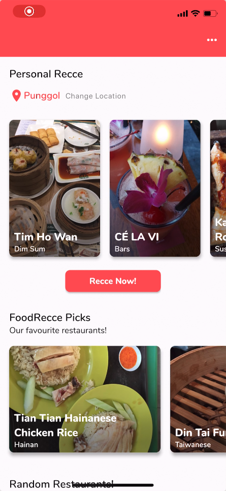

FoodRecce Example
=================

**FoodRecce** (in short for Food Reconnaissance) is an application that allows
users to search for food places around their current location.

FoodRecce is a mobile app that allows users to provide feedback (**like/dislike**)
the restaurants they love or dislike. The feedback is then used to recommend
other restaurants that the user may like.

**FoodRecce Architecture**

The above diagram shows the architecture of FoodRecce. The mobile app is
connected to a backend server, which is connected to a database. The database
stores the information of the restaurants, as well as the feedback provided
by the users.

Training data
-------------

Implicit data was collected by the users of FoodRecce. The data is in the form
of user feedback on the restaurants. The feedback is in the form of
**like/dislike** or in binary form, 1 or 0.

The data is being loaded from the database. A simple SQL statement
``SELECT * FROM feedbacks`` could be used to obtain the feedback data on Python.

.. code-block:: python

    # Converted data as a list of UIR (user, item, rating) tuples
    data = [
        ("uid_001", "restaurant_032", 1),
        ("uid_954", "restaurant_012", 0),
        ("uid_022", 'resturant_027', 1),
        ...
    ]

We then convert the data to the dataset format:

.. code-block:: python

    from cornac.data import Dataset

    dataset = Dataset.from_uir(data, seed=123)

How the recommender was built
-----------------------------

We use the BPR recommender to build the recommendation system for FoodRecce.
Based on historical data, we are able to rank other unseen restaurants based
on the user's past preferences.

Assuming that we have already experimented different parameters and values for
the BPR model, we can then train the recommender system.

.. code-block:: python

    from cornac.models import BPR

    bpr = BPR(k=10, max_iter=100, learning_rate=0.01, lambda_reg=0.001, seed=123)

    bpr.fit(dataset)

    # Save the model
    bpr.save(save_dir="saved_models")

This in turn saves the model which we could reuse for future predictions.
For the FoodRecce use case, we often retrain the model with new data as new
restaurants are often added to the database, along with the increase of new users.

.. note::

    While it may not be essential to save the model, it is good practice to do
    so. This is because we can then load the model directly from the saved
    directory without having to retrain the model again.

Providing feedback
------------------

FoodRecce gives recommendations based on the trained model. We give users a
mix of restaurants that they might not have seen before, as well as
restaurants that they could have previously liked.

This swiping interface gives users the opportunity to further provide the
system more ideas on what they may like or dislike. Depending on our scenario,
this could be just random sampling of restaurants, or specifically ranked
restaurants based on an algorithm on Cornac.

Giving recommendations
----------------------

After training the model, we can then use the model to make recommendations
for users. We utilize a ranking strategy to provide recommendations.

You can easily do this by loading the model and calling the ``recommend``
method.

We first load our saved model. For subsequent runs, we can load the model
directly from the saved directory.

.. code-block:: python

    from cornac.models import BPR

    bpr = BPR.load("saved_models/BPR")

Now, given that our backend receives a load request from a user with id
``uid_001``, we can then make recommendations for this user.

.. code-block:: python

    # variables are shown here for brevity
    user_id = "uid_001"
    top_k = 10

    def get_recommendations(user_id, top_k):
        # Get the top k recommendations for user with id user_id
        top_k_recs = bpr.recommend(user_id=user_id, top_k=top_k)
        return top_k_recs

For example, the values returned will be as follows;

.. code-block:: bash

    [
        'restaurant_038',
        'restaurant_012',
        'restaurant_027',
        'restaurant_081',
        'restaurant_002',
        'restaurant_030',
        'restaurant_104',
        'restaurant_235',
        'restaurant_006',
        'restaurant_007'
    ]

Your backend server will then return the list of recommendations to the
mobile app. Depending on how the interface is, the mobile app will then
display the recommendations to the user.

In FoodRecce's scenario, we display the recommendations in a format in
which users could navigate and find out more about the restaurants.
This is done with the integration of FoodRecce's database of restaurants.

Updating the Model
------------------

Over the months, many new restaurants and food establishments would have
been introduced to the public. To keep the app relevant, we would need to
retrain the model with the new data. With an data source, new restaurants
are consistently added into the database, in which we would retrain the
model to increase coverage of restaurants. Also, we periodically update 
the model to better capture users' most recent preferences.

Conclusion
----------

We have just briefly shown you how to build a recommendation system for a 
food recommendation app. There are many uses for recommender systems.

There are various strategies in which you could use Cornac for, and we hope
that you have learned how to use Cornac for your own projects and applications.

Feel free to try to building your own recommendation system for your own
application, and share them with us!

What's Next?
------------

Now that you have learned how to use Cornac for your own projects and
applications, you can now start building your own recommendation systems using
Cornac.

.. topic:: View the Developer Quickstart

  View a quickstart guide on how you can code and implement Cornac onto your
  application to provide recommendations for your users.

  View :doc:`/user/iamadeveloper`.

.. topic:: View the Models API Reference

    You can also view the :doc:`/api_ref/models` documentation for more
    information about the models and its specific parameters.

Others
------

.. topic:: Are you a data scientist?

  Find out how you can have Cornac as part of your workflow to run your
  experiments, and use Cornac's many models with just a few lines of code.
  View :doc:`/user/iamaresearcher`.

.. topic:: For all the awesome people out there

  No matter who you are, you could also consider contributing to Cornac,
  with our contributors guide.
  View :doc:`/developer/index`.