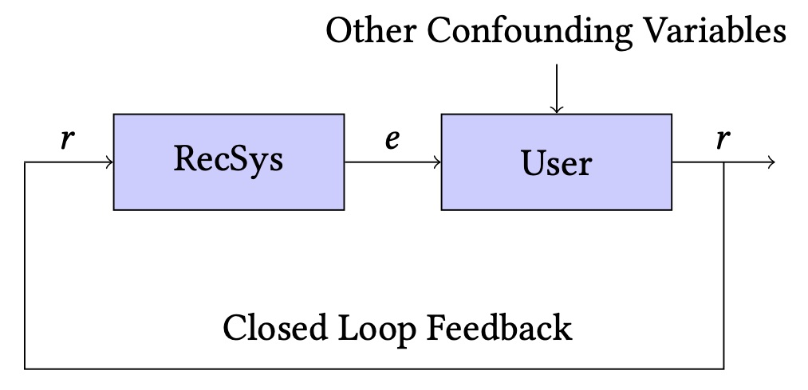

# Propensity-based Stratified Evaluation Method


Recommendation systems are often evaluated based on user’s interactions that were collected from an existing deployed system (see the above figure [Jadidinejad et al.](https://doi.org/10.1145/3397271.3401230)). Users only provide feedback (r) on those items they were exposed to by the deployed system (e). Hence, the collected feedback dataset used to evaluate a new model is influenced by the deployed system (RecSys), as a form of closed loop feedback. In this situation, [Jadidinejad et al.](https://arxiv.org/abs/2104.08912) revealed that the typical offline evaluation of recommenders suffers from the so-called Simpson’s paradox, which is a phenomenon observed when a significant trend appears in several different sub-populations of observational data but that disappears or reverses when these sub-populations are combined together. In addition, they proposed a novel evaluation methodology (Propensity-based Stratified Evaluation) that takes into account the confounder, i.e. the deployed system’s characteristics.

See [the paper](https://arxiv.org/abs/2104.08912) for more details.

Using the proposed propensity-based stratified evaluation method is as simple as using the classic evaluation in Cornac:

```python
import cornac
from cornac.models import MF, PMF, BPR
from cornac.metrics import MAE, RMSE, Precision, Recall, NDCG, AUC, MAP

from cornac.eval_methods import PropensityStratifiedEvaluation
from cornac.experiment import Experiment


stra_eval_method = PropensityStratifiedEvaluation(data=ml_100k,
                                                  n_strata=2,
                                                  rating_threshold=4.0,
                                                  verbose=True)


models = [
    MF(k=10),
    BPR(k=10),
]

metrics = [MAE(), RMSE(), Precision(k=10),
           Recall(k=10), NDCG(), AUC(), MAP()]

exp_stra = Experiment(eval_method=stra_eval_method,
                      models=models, metrics=metrics)

exp_stra.run()

```

Compared to [the classic evaluation](https://github.com/PreferredAI/cornac#getting-started-your-first-cornac-experiment), you can simply use `PropensityStratifiedEvaluation` instead of `RatioSplit`. The output is based on the defined strata (Q1, Q2,...) and the "Unbiased" row represents the performance prediction based on Stratified Evaluation method:

```
[MF]
         |    MAE |   RMSE |    AUC |    MAP | NDCG@-1 | Precision@10 | Recall@10 |       SIZE
-------- + ------ + ------ + ------ + ------ + ------- + ------------ + --------- + ----------
Closed   | 0.7450 | 0.8988 | 0.7422 | 0.0396 |  0.3038 |       0.0450 |    0.0346 | 19956.0000
-------- + ------ + ------ + ------ + ------ + ------- + ------------ + --------- + ----------
IPS      | 0.7450 | 0.8988 | 0.7422 | 0.0396 |  0.1907 |       0.0011 |    0.0286 | 19956.0000
-------- + ------ + ------ + ------ + ------ + ------- + ------------ + --------- + ----------
Q1       | 0.7464 | 0.9001 | 0.7395 | 0.0377 |  0.2992 |       0.0404 |    0.0299 | 19843.0000
Q2       | 0.5403 | 0.5403 | 0.9915 | 0.1254 |  0.2971 |       0.0417 |    0.4175 |   113.0000
-------- + ------ + ------ + ------ + ------ + ------- + ------------ + --------- + ----------
Unbiased | 0.7453 | 0.8981 | 0.7409 | 0.0382 |  0.2991 |       0.0404 |    0.0321 | 19956.0000
```

`SIZE` column represents the number of feedback in each stratum (`Q1` or `Q2`). `Unbiased` row represents the estimated propensity-based evaluation per each metric while `Closed` row represents the classical evaluation.

## How to cite?
Use the corresponding bibtex entry to cite the paper:

```
@InProceedings{simpson_recsys20,
  author    = {Amir H. Jadidinejad and Craig Macdonald and Iadh Ounis},
  title     = {The Simpson's Paradox in the Offline Evaluation of Recommendation Systems},
  journal   = {ACM Transactions on Information Systems (to appear)},
  year      = {2021},
}
```